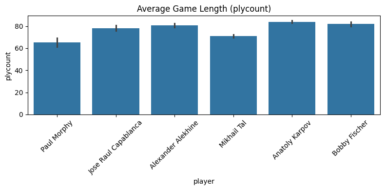
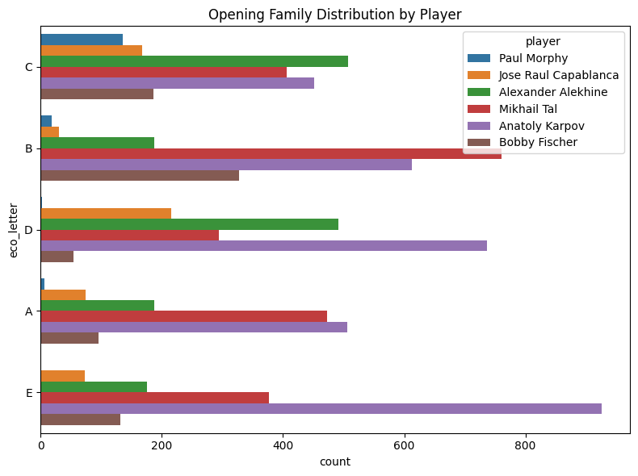
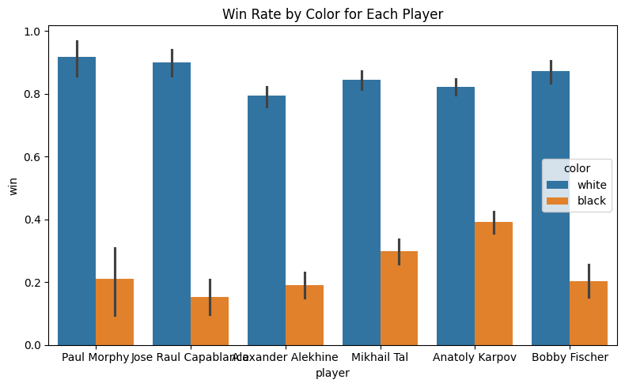

# Comparative Data Analysis of Chess Masters Using PGN Archives

## Purpose and Motivation
- This project aims to perform a structured, data-driven analysis of the playing styles and statistical tendencies of several classical chess masters, using their complete game archives in PGN format. While the games of legends such as Paul Morphy, José Raúl Capablanca, Alexander Alekhine, Mikhail Tal, Anatoly Karpov, and Bobby Fischer have been studied extensively from a historical and strategic perspective, they are rarely examined through a modern data-science lens.

- Chess literature often focuses on qualitative commentary, personal impressions, or selected landmark games. However, with thousands of games now digitized, there is an opportunity to complement traditional chess theory with quantitative insights. By cleaning, filtering, and analyzing these datasets, we can answer questions such as:

  - Which openings did each player favor, and how did their opening choices evolve?
  - How long were their games on average?
  - How do their win rates differ when playing White vs. Black?
  - Are certain ECO families strongly associated with specific players’ styles?
  - Do historical narratives (e.g., “Capablanca’s clarity”, “Tal’s aggression”, “Karpov’s precision”) show measurable patterns in the data?

- The motivation behind this project is not only to validate or challenge widely-held beliefs about these players but also to demonstrate how classical game data can be transformed into meaningful visual analytics using Python, Pandas, Matplotlib, and Seaborn.

- This work showcases how data science techniques can extract trends from large historical datasets, turning raw PGN files into interpretable insights about some of the greatest chess players of all time.


## Data

- A PGN (Portable Game Notation) is the standard text-based file format used to store chess games.
- A PGN file contains:
  - Game metadata (player names, event, site, date, result, ECO code, etc.)
  - Move list recorded in algebraic notation
  - Optional annotations or comments

- PGNs are widely used because they are both machine-readable (easy to parse programmatically) and human-readable (you can open them in any text editor).
- This format makes PGNs ideal for large-scale data extraction and statistical analysis.

### Data Source

- The PGN files for each player were downloaded from PGN Mentor, one of the most complete and standardized archives of classical players’ games. I selected this source for three main reasons:

  - **1. High completeness**  
    PGN Mentor provides nearly all recorded games for historical players like Morphy, Capablanca, Alekhine, Tal, Karpov, and Fischer.

  - **2. Standardized metadata**  
    The PGNs from PGN Mentor follow consistent formatting conventions, making them easier to parse with Python's `chess.pgn` module.  
    Fields such as:
    - Event  
    - Site  
    - Date  
    - ECO  
    - Result  
    are usually available and structured.

  - **3. Offline, stable dataset**  
    Unlike web scraping from Chess.com or ChessGames.com (which may fail due to rate limits or inconsistent formatting), the PGN Mentor files:
    - Are already zipped and downloadable  
    - Do not change over time  
    - Require no API key  
    This ensures reproducibility of the study.

### Data Cleaning & Preparation

- After parsing ~9,200 raw games, a cleaning process was necessary before performing meaningful analysis.  
- The steps below describe how the dataset was prepared and filtered:

#### 1. Parsing all PGNs into a unified DataFrame

- For each player, every game was parsed using Python’s python-chess library.
- From each game, the following fields were extracted:
  - Player  
  - Color (white/black)  
  - Opponent  
  - Result (1-0, 0-1, 1/2-1/2)  
  - Event  
  - Site  
  - Date  
  - Year (first 4 characters of Date)  
  - ECO code (PGN files contain ECO codes instead of direct opening names, the opening name will be derived from `eco_dict.py` by finding what their ECO codes correspond to)  
  - Opening name (via ECO lookup)  
  - Number of half-moves (plycount as used in the code)

- This produced a raw master dataset of 9,256 games.

#### 2. Removing invalid or uninformative games

- Some games needed to be excluded:

  - **Incomplete or corrupted PGNs**  
    Games missing essential fields (ECO, result, or valid plycount) were removed.

  - **Games with “NN” opponents**  
    “NN” stands for “No Name,” typically used in:
    - casual games  
    - practice games  
    - unrecorded opponent games  
    These are not suitable for competitive statistical comparison.

  - **Simuls, Blindfold, Odds, and Exhibition games**  
    These were detected via keywords in the Event field:
    - “Simul”  
    - “Blindfold”  
    - “Odds”  
    - “Exhibition”  
    - "Handicap"  
    - “Training”  
    These formats do not represent standard tournament play and would distort win-rate or opening-preference statistics.

#### 3. Filtering by valid year

- Games with missing or placeholder dates like `"????.??.??"` were removed.
- Only games with a numeric 4-digit year were kept.

#### 4. Final Dataset

- After cleaning:
  - Initial size: **9,256**
  - Final size: **8,612** games

- All games are:
  - Standard competitive games  
  - Played against real opponents  
  - With valid ECO codes  
  - With valid move counts  
  - Free of simul/exhibition/odds formats

- Parsed with `python-chess` into a cleaned CSV:  
  **`masters_cleaned_final.csv`**

---

## Goals

- Exploratory Data Analysis (EDA) of game lengths, openings, and results.
- Hypothesis tests:
  - Do different players have significantly different average game lengths?
  - Do players prefer different ECO opening families?
  - Does win rate differ between White and Black?

---

### 1. Average Game Length Differences (half-moves)

**Research Question:**  
Do different players tend to play longer games on average?

**Hypotheses:**

- **H₀:** All six players have the same average plycount.  
- **H₁:** At least one player’s average plycount differs.  
  (There is a significant difference in game length between players.)

**Visualization:**  


---

### 2. Opening Family Preferences (ECO Letter A–E)

**Research Question:**  
Do players differ in the types of openings they prefer (ECO families A–E)?

**Hypotheses:**

- **H₀:** The distribution of ECO opening families is the same for all players.  
  (No player shows a unique opening preference.)

- **H₁:** At least one player has a different opening family distribution.  
  (Players prefer different openings.)

**Visualization:**  


---

## 3. Win Rate Differences Between White and Black

**Research Question:**  
Is a player's win rate significantly different when playing White vs. playing Black?

**Hypotheses:**

- **H₀:** Win rate(White) = Win rate(Black)  
  (Playing White does not change the probability of winning.)

- **H₁:** Win rate(White) ≠ Win rate(Black)  
  (There is a difference in win rate based on color.)

**Visualization:**  


---

## Reproducing

```bash
pip install -r requirements.txt
python parse_pgns.py
python clean_dataset.py
# then open analysis.ipynb
